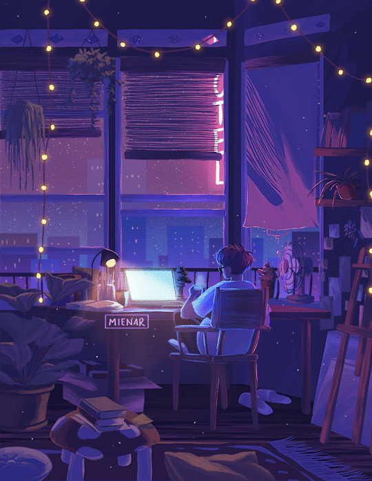

<!-- <h2 align="left">Hi 👋 this is Nayan...</h2>

MSc Computer Science Student | AI/ML | NLP | MERN Stack

### -->
<!-- HEADER: Generated by capsule-render. Replace YOUR_USERNAME and YOUR_NAME.
     Colors: dark blue (#0F172A) to blue (#1D4ED8) to green (#22C55E).
     Change description text to match your tagline.
     See https://github.com/kyechan99/capsule-render for full options. -->

  

 

<!-- TYPING ANIMATION: Generated by readme-typing-svg. Replace YOUR_USERNAME and customize the lines.
     Font: Fira Code. Color matches accent green. Add or remove lines as needed.
     See https://github.com/DenverCoder1/readme-typing-svg for options. -->

  

 

 

  

###

  <table>
    <tr>
      <!-- Left Side: Stats Containers -->
      <td>
        
         
        
         
        
      </td>
     <td align="center">
        
      </td>
    </tr>
  </table>

###

  
  
  
  
  
  
  
  
  
  
  
  
  
  
  
  
  
  
  
  
  
  
  
  
  
  
  
  
  
  
  
  
  
  
  
  
  
  
  
  
  
  
  
  
  
  
  

###

 

 

  
  
  
  
  

###

  

###

  

###

  

<a href="https://gssoc.girlscript.tech/leaderboard">

  
  
  
  
  
  
  

###

  

